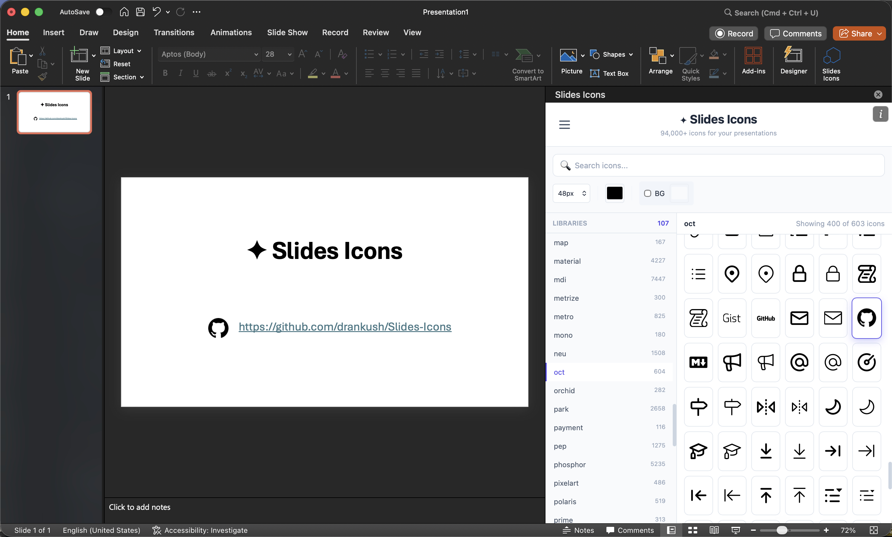

<div align="center">

<h1>✦ Slides Icons</h1>

<a href="https://opensource.org/licenses/MIT">
  
</a>
<a href="https://github.com/drankush/Slides-Icons">
  
</a>
<a href="https://github.com/drankush/Slides-Icons">
  
</a>
<a href="https://github.com/drankush/Slides-Icons">
  
</a>
<a href="https://github.com/cenfun/open-icons">
  
</a>

<p>
<b>A PowerPoint Add-in with 94,000+ free icons from 108 open-source libraries.</b>
</p>



</div>

## 🚀 Installation (macOS)

### Easy Install (Recommended)
1. **[Download the latest release](https://github.com/drankush/Slides-Icons/releases/latest)** (`Slides-Icons-Installer.zip`)
2. Unzip the downloaded file
3. **Right-click** `Install-Icons.command` and select **Open**
   > ⚠️ If you see "unidentified developer" warning, click **Open** again
   > The script will automatically copy `manifest.xml` to the correct location for PowerPoint.
4. Restart PowerPoint
5. Go to **Insert** → **My Add-ins** → **Developer Add-ins** (or **Shared Folder**)
6. Click **Slides Icons** to open the panel

### Installation (Windows)
1. Download `manifest.xml` from [Releases](https://github.com/drankush/Slides-Icons/releases/latest)
2. Place it in a shared network folder
3. In PowerPoint: **Insert** → **My Add-ins** → **Shared Folder** → Add the folder path

---

## ✨ Features

- **global Search** - **NEW!** Toggle "Global" search to find icons across ALL 108 libraries simultaneously.
- **108 Icon Libraries** - Bootstrap, FontAwesome, Material Design, Tabler, Phosphor, and now including **Health Icons**!
- **94,000+ Icons** - Comprehensive coverage for any presentation need
- **Collapsible Sidebar** - Toggle libraries panel for more icon grid space
- **Load More** - Browse all icons with incremental loading (50 at a time)
- **Custom Colors** - Apply any color to icons with live preview
- **Background Support** - Add background colors to icon cards
- **Multiple Sizes** - Export at 24px, 48px, 64px, 96px, or 128px
- **Fast Search** - Instantly filter icons by name
- **Offline-Ready** - All icons embedded locally, no CDN dependencies

## 📚 Library Categories

| Category | Libraries |
|----------|-----------|
| **General** | Bootstrap, Feather, Lucide, Tabler, Heroicons, Iconoir |
| **Material** | Material Design Icons (7000+), Material Symbols |
| **Brands** | Simple Icons, Logos, Dev Icons |
| **Medical** | **Health Icons** (New!) - Specialized medical and health-related icons |
| **Specialized** | Crypto (coins), Flag (countries), Weather, Maps |
| **Multi-color** | Crypto, Flag, Logos, Ant Design Mobile |

---

## 🛠 Development

<details>
<summary>Click to expand development setup</summary>

### Prerequisites
- Node.js 18+
- npm

### Setup
```bash
# Install dependencies
npm install

# Extract icons from open-icons package (~1 min)
npm run extract-icons

# Build the add-in
npm run build

# Start local dev server
npm start
```

### Sideload for Development (macOS)
```bash
mkdir -p ~/Library/Containers/com.microsoft.Powerpoint/Data/Documents/wef
cp manifest.xml ~/Library/Containers/com.microsoft.Powerpoint/Data/Documents/wef/
```

### Project Structure
```
Slides-Icons/
├── src/
│   ├── taskpane/          # Main UI (HTML, CSS, JS)
│   └── manifests/         # Extracted icon JSON files (107 libraries)
├── scripts/
│   ├── extract-open-icons.js   # Icon extraction script
│   └── build.js                # Build script
├── images/                # Screenshots and assets
├── dist/                  # Built output (deployed to GitHub Pages)
├── manifest.xml          # Development manifest (localhost)
└── manifest-prod.xml     # Production manifest (GitHub Pages)
```

</details>

---

## 🙏 Credits

- **Icons**: Powered by [Open-Icons](https://github.com/cenfun/open-icons) by Cenfun
- All icons are licensed under their respective open-source licenses (MIT, Apache, etc.)

## 📄 License

MIT License - Free for personal and commercial use.
